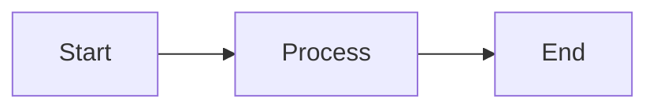

# VimAbl Documentation

This directory contains the source files for VimAbl's documentation site, built with [MkDocs Material](https://squidfunk.github.io/mkdocs-material/).

## 📚 Documentation Structure

```
docs/
├── index.md                    # Homepage
├── installation.md             # Installation guide
├── quick-start.md              # Quick start guide
├── user-guide/                 # User documentation
│   ├── overview.md
│   ├── navigation.md
│   ├── editing.md
│   ├── session-vs-arrangement.md
│   ├── keybindings.md
│   ├── udp-observers.md
│   └── web-treeviewer.md
├── architecture/               # System design docs
│   ├── overview.md
│   ├── websocket-ast.md
│   ├── data-flow.md
│   ├── hammerspoon-integration.md
│   └── python-remote-script.md
├── api-reference/              # API documentation
│   ├── commands.md
│   ├── lua-api.md
│   └── osc-protocol.md
├── development/                # Developer guides
│   └── extending.md
├── planned-features.md         # Roadmap
├── troubleshooting.md          # Common issues
├── faq.md                      # FAQ
├── changelog.md                # Version history
└── _auto-generated/            # Auto-generated content
    ├── README.md
    ├── keybindings-table.md
    └── observers-table.md
```

## 🛠️ Building Documentation

### Prerequisites

```bash
# Install dependencies
uv pip install mkdocs mkdocs-material mkdocs-git-revision-date-localized-plugin
```

### Local Development

```bash
# Generate auto-generated docs
python tools/extract_keybindings.py > docs/_auto-generated/keybindings-table.md
python tools/extract_observers.py > docs/_auto-generated/observers-table.md

# Serve documentation locally with live reload
mkdocs serve

# Open http://127.0.0.1:8000 in your browser
```

### Build for Production

```bash
# Build static site
mkdocs build

# Output will be in site/ directory
```

## 🚀 Deployment

Documentation is automatically deployed to GitHub Pages when changes are pushed to the `main` branch.

### GitHub Pages Workflow

The `.github/workflows/docs.yaml` workflow:

1. **Triggers on**:
   - Push to `main` or `feature/docs` branches
   - Changes to `docs/**`, `mkdocs.yml`, or extraction scripts
   - Manual workflow dispatch

2. **Build process**:
   - Sets up Python and installs dependencies
   - Generates auto-documentation from source code
   - Builds static site with MkDocs
   - Uploads artifact to GitHub Pages

3. **Deployment**:
   - Automatically deploys to GitHub Pages on `main` push
   - Creates PR preview artifacts for pull requests

### Viewing Deployed Docs

- **Production**: https://marvinhauke.github.io/VimAbl/
- **Preview**: Available as artifacts in pull request workflows

## 📝 Writing Documentation

### Markdown Features

The documentation supports rich markdown features through MkDocs Material:

#### Code Blocks

```python
# Python code with syntax highlighting
def example():
    return "Hello World"
```

#### Admonitions

```markdown
!!! info "Information"
    This is an info box

!!! warning "Warning"
    This is a warning box

!!! tip "Pro Tip"
    This is a tip box
```

#### Mermaid Diagrams

```markdown

```

#### Keyboard Keys

```markdown
Press ++ctrl+shift+r++ to reload
```

### Auto-Generated Content

Some documentation is automatically extracted from source code:

- **Keybindings** - From `src/hammerspoon/**/*.lua`
- **Observers** - From `src/remote_script/observers.py`
- **Commands** - From `src/remote_script/` (if extraction script exists)

To include auto-generated content:

```markdown
--8<-- "docs/_auto-generated/keybindings-table.md"
```

## 🔍 Validation

The workflow includes validation steps:

- **Link checking** - Ensures all internal links work
- **Build verification** - Confirms successful build
- **Strict mode** - Fails on warnings

## 📋 Contributing

When contributing to documentation:

1. **Follow structure** - Keep files organized by topic
2. **Use consistent style** - Match existing documentation tone
3. **Include examples** - Show, don't just tell
4. **Test locally** - Run `mkdocs serve` before pushing
5. **Update navigation** - Add new pages to `mkdocs.yml`

## 🐛 Troubleshooting

### Build fails locally

```bash
# Clear cache and rebuild
rm -rf site/
mkdocs build --clean
```

### Missing auto-generated files

```bash
# Regenerate from source
python tools/extract_keybindings.py > docs/_auto-generated/keybindings-table.md
python tools/extract_observers.py > docs/_auto-generated/observers-table.md
```

### Live reload not working

```bash
# Try a different port
mkdocs serve -a 127.0.0.1:8001
```

## 📚 Resources

- [MkDocs Documentation](https://www.mkdocs.org/)
- [Material for MkDocs](https://squidfunk.github.io/mkdocs-material/)
- [Markdown Guide](https://www.markdownguide.org/)
- [Mermaid Diagrams](https://mermaid.js.org/)
