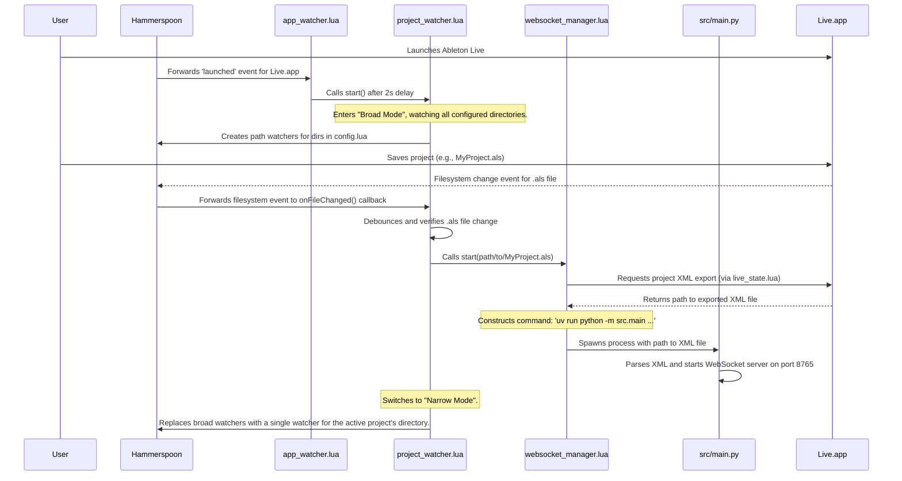

# Hammerspoon Integration and Startup Sequence

The integration with [Hammerspoon](https://www.hammerspoon.org/) is the cornerstone of VimAbl's ability to automatically react to system and application-level events on macOS. It acts as the "glue" that monitors Ableton Live and launches the backend Python server at the right moment, creating a seamless user experience.

This document details the architecture of the Hammerspoon scripts and the step-by-step startup sequence.

## Core Components

The Hammerspoon logic is modular, broken down into several key Lua scripts located in `src/hammerspoon/`:

- **`app_watcher.lua`**: The entry point. Its sole responsibility is to watch for macOS applications launching and terminating. It specifically looks for "Live.app".

- **`project_watcher.lua`**: Activated by the `app_watcher`. This script watches specific filesystem directories for changes to Ableton Live project files (`.als`). It is designed to be efficient, with a "broad" scanning mode and a "narrow" single-project mode.

- **`config.lua`**: A user-configurable file that defines which directories the `project_watcher` should monitor. This allows users to add their own project folders.

- **`websocket_manager.lua`**: This script manages the lifecycle of the Python WebSocket server. It contains the logic to start, stop, and restart the server process using `uv`.

- **`live_state.lua`**: A utility script that communicates with Ableton Live to perform actions, most critically, to export the project's state as an XML file.

## Startup Sequence Diagram

The following diagram illustrates the complete startup process, from launching Ableton Live to the WebSocket server being ready.

## Step-by-Step Breakdown

1.  **Hammerspoon Initialization**: When Hammerspoon is launched or its configuration is reloaded, the main `init.lua` script sets up all the components. Specifically, it calls `app_watcher.setup()`, which starts a global application watcher.

2.  **Ableton Launch**: The user starts Ableton Live. The `app_watcher` detects the "Live.app" launch event.

3.  **Project Watcher Activation**: Upon detecting the launch, `app_watcher` waits for a brief period (2 seconds) to ensure Ableton is loading, and then calls `projectWatcher.start()`.

4.  **"Broad Mode" Watch**: `projectWatcher` begins in "broad mode". It reads the list of directories from `config.projectWatchDirs` and creates filesystem watchers for each of their immediate subdirectories. This is an optimization to avoid watching a user's entire home directory, for instance.

5.  **Project Save Event**: The user works in Ableton and saves their project (Cmd+S). This action modifies the `.als` file on the disk.

6.  **Detection and Debouncing**: The filesystem watcher detects the change to the `.als` file and triggers the `onFileChanged` callback in `project_watcher.lua`. This function confirms the file change is valid and debounces the event to prevent multiple triggers from a single save action.

7.  **Server Launch Trigger**: The project watcher then calls `websocket_manager.start(path)`, passing the full path to the `.als` file that was just saved.

8.  **Project State Export**: The `websocket_manager`'s first action is to ask Ableton Live to export its current state to an XML file. This is handled by the `live_state.exportXML()` function, which places the resulting `.xml` file inside a `.vimabl` directory within the Ableton project folder.

9.  **Python Process Spawn**: With the XML file created, `websocket_manager` constructs the full shell command to launch the Python server (e.g., `uv run python -m src.main /path/to/project.xml --mode=websocket`). It then executes this command using `hs.task`.

10. **WebSocket Server Ready**: The Python script `src/main.py` starts, parses the XML file into an Abstract Syntax Tree (AST), and launches the WebSocket server, which is now ready to accept connections from the web frontend.

11. **"Narrow Mode" Switch**: After successfully triggering the server start, the `project_watcher` switches to "narrow mode". It stops all the broad directory watchers and creates a single, more efficient watcher that only monitors the directory of the currently active project. This conserves system resources.