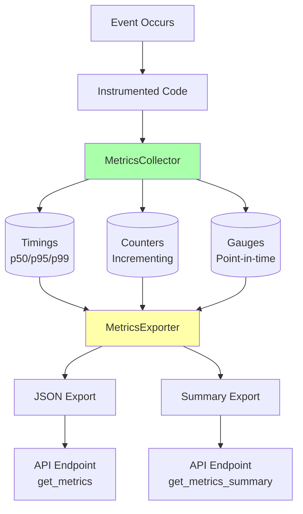

# Metrics & Telemetry System

Comprehensive monitoring and metrics collection for the AST server to track performance, detect issues, and optimize the system.

## Overview

The metrics system provides real-time visibility into:
- **Event processing performance** (latency, throughput)
- **UDP packet health** (loss rate, gaps)
- **WebSocket connectivity** (clients, broadcasts)
- **Cache effectiveness** (hit rates)
- **Error tracking** (by type and frequency)
- **System health** (uptime, resource usage)

**Key Benefits:**
- 📊 **Data-driven optimization** - Know what to optimize
- 🔍 **Proactive monitoring** - Detect issues before users complain
- 📈 **Performance tracking** - Track improvements over time
- 🚨 **Alerting** - Set thresholds for critical metrics

## Quick Start

### Basic Usage

```python
from src.server.api import ASTServer

# Metrics enabled by default
server = ASTServer()

# Process some events...
await server.process_live_event("/live/track/renamed", [0, "Bass"], 1, time.time())

# Get metrics summary
summary = server.get_metrics_summary()
print(f"Event processing latency (p95): {summary['event_processing']['latency_ms']['p95']}ms")
print(f"Total events processed: {summary['event_processing']['total_processed']}")

# Get full metrics
metrics = server.get_metrics()
print(json.dumps(metrics, indent=2))
```

### Output Example

```json
{
  "timestamp": "2025-11-28T10:30:00",
  "uptime_seconds": 3600.5,
  "event_processing": {
    "total_processed": 15420,
    "latency_ms": {
      "p50": 5.2,
      "p95": 18.7,
      "p99": 45.3
    }
  },
  "udp_listener": {
    "packets_received": 15500,
    "packets_dropped": 80
  },
  "websocket": {
    "clients_connected": 3,
    "broadcasts_sent": 15420
  },
  "cache": {
    "hit_rate_percent": 87.3
  },
  "errors": {
    "errors.event_processing": 2
  }
}
```

## Architecture



## Core Concepts

### Metric Types

#### 1. **Timings** - Duration Measurements

Tracks how long operations take, with percentile calculations.

```python
# Manual timing
start = time.time()
process_event()
duration = time.time() - start
server.metrics.timing('event.processing', duration)

# Context manager (recommended)
with server.metrics.timer('event.processing'):
    process_event()

# Get statistics
stats = server.metrics.get_timing('event.processing')
print(f"Mean: {stats['mean']:.3f}s")
print(f"p50: {stats['p50']:.3f}s")
print(f"p95: {stats['p95']:.3f}s")
print(f"p99: {stats['p99']:.3f}s")
```

**When to use**: Any operation where latency matters (event processing, API calls, database queries)

#### 2. **Counters** - Incrementing Values

Tracks counts of events or occurrences.

```python
# Increment by 1
server.metrics.increment('events.processed')

# Increment by custom amount
server.metrics.increment('events.dropped', amount=5)

# Decrement
server.metrics.decrement('websocket.clients')

# Get current value
stats = server.metrics.get_counter('events.processed')
print(f"Total events: {stats['value']}")
```

**When to use**: Counting events, errors, requests, connections

#### 3. **Gauges** - Point-in-Time Values

Tracks current state or value that can go up and down.

```python
# Set current value
server.metrics.gauge('websocket.clients', 3.0)
server.metrics.gauge('cache.hit_rate', 0.87)
server.metrics.gauge('udp.current_sequence', 12345.0)

# Get statistics (current, min, max, mean)
stats = server.metrics.get_gauge('websocket.clients')
print(f"Current: {stats['current']}")
print(f"Peak: {stats['max']}")
print(f"Average: {stats['mean']}")
```

**When to use**: Current connections, queue depth, memory usage, percentages

### Tags for Categorization

Use tags to categorize metrics by different dimensions:

```python
# Event type categorization
server.metrics.timing(
    'event.processing.duration',
    duration,
    tags={'event_type': '/live/track/renamed'}
)

server.metrics.increment(
    'events.processed',
    tags={'event_type': '/live/scene/added'}
)

# Handler categorization
server.metrics.timing(
    'handler.duration',
    duration,
    tags={'handler': 'scene_handler'}
)

# Get metrics by tag
stats = server.metrics.get_timing(
    'event.processing.duration',
    tags={'event_type': '/live/track/renamed'}
)
```

## Automatically Tracked Metrics

The AST server automatically tracks these metrics:

### Event Processing

```python
# Every event processed
'events.received'                          # Counter: Total events received
'events.received.by_type'                  # Counter: By event type (tagged)
'events.processed'                         # Counter: Successfully processed
'events.processed.by_type'                 # Counter: By event type (tagged)
'events.ignored.no_ast'                    # Counter: Ignored (no AST loaded)
'events.unhandled'                         # Counter: Unhandled event types
'events.unhandled.by_type'                 # Counter: By event type (tagged)
'event.processing.duration'                # Timing: Processing time
'event.processing.duration[event_type=*]'  # Timing: By event type (tagged)
```

### Errors

```python
'errors.event_processing'                  # Counter: Processing errors
'errors.event_processing.by_type'          # Counter: By event type (tagged)
```

### Example: Viewing Auto-Tracked Metrics

```python
# Get all metrics
all_metrics = server.get_metrics()

# Event counters
counters = all_metrics['metrics']['counters']
print(f"Total events received: {counters['events.received']['value']}")
print(f"Total events processed: {counters['events.processed']['value']}")
print(f"Total errors: {counters.get('errors.event_processing', {}).get('value', 0)}")

# Event timings
timings = all_metrics['metrics']['timings']
for key, stats in timings.items():
    if 'event.processing.duration' in key:
        print(f"{key}:")
        print(f"  p50: {stats['p50']*1000:.2f}ms")
        print(f"  p95: {stats['p95']*1000:.2f}ms")
```

## Usage Examples

### Example 1: Basic Monitoring

```python
# Create server with metrics
server = ASTServer(enable_metrics=True)

# Simulate event processing
for i in range(100):
    await server.process_live_event(
        "/live/track/renamed",
        [i % 10, f"Track {i}"],
        i,
        time.time()
    )

# Check performance
summary = server.get_metrics_summary()
print(f"Processed {summary['event_processing']['total_processed']} events")
print(f"p95 latency: {summary['event_processing']['latency_ms']['p95']}ms")
```

### Example 2: Custom Metrics in Handlers

```python
class CustomHandler(BaseEventHandler):
    async def handle_custom_event(self, args, seq_num):
        # Time the operation
        with self.server.metrics.timer('custom.operation'):
            result = await self._do_work(args)

        # Track success/failure
        if result:
            self.server.metrics.increment('custom.success')
        else:
            self.server.metrics.increment('custom.failure')

        # Track gauge (e.g., queue depth)
        self.server.metrics.gauge('custom.queue_depth', len(self.queue))

        return result
```

### Example 3: Performance Profiling

```python
# Profile specific operations
def profile_ast_operations(server):
    # Track different operations
    with server.metrics.timer('operation.load_project'):
        server.load_project("test.als")

    with server.metrics.timer('operation.find_tracks'):
        server.find_nodes_by_type('track')

    with server.metrics.timer('operation.compute_diff'):
        server.diff_with_file("test2.als")

    # Print profiling results
    operations = ['load_project', 'find_tracks', 'compute_diff']
    for op in operations:
        stats = server.metrics.get_timing(f'operation.{op}')
        if stats:
            print(f"{op}: {stats['mean']*1000:.2f}ms (p95: {stats['p95']*1000:.2f}ms)")
```

### Example 4: Monitoring Over Time

```python
import time

# Reset metrics to start fresh
server.metrics.reset()

# Run for 60 seconds
start_time = time.time()
while time.time() - start_time < 60:
    # Process events...
    await process_events()

    # Check metrics every 10 seconds
    if int(time.time() - start_time) % 10 == 0:
        summary = server.get_metrics_summary()
        print(f"[{int(time.time() - start_time)}s] "
              f"Processed: {summary['event_processing']['total_processed']}, "
              f"p95: {summary['event_processing']['latency_ms']['p95']}ms")

# Final summary
final_metrics = server.get_metrics_summary()
print("\nFinal Statistics:")
print(json.dumps(final_metrics, indent=2))
```

### Example 5: Error Tracking

```python
# Track different error types
try:
    process_event()
except ValueError as e:
    server.metrics.increment('errors.validation',
                            tags={'error_type': 'ValueError'})
except KeyError as e:
    server.metrics.increment('errors.missing_key',
                            tags={'error_type': 'KeyError'})

# Check error rates
all_metrics = server.get_metrics()
for key, stats in all_metrics['metrics']['counters'].items():
    if 'error' in key:
        print(f"{key}: {stats['value']}")
```

### Example 6: UDP Packet Loss Tracking

```python
# In UDP listener callback
async def udp_event_callback(event_path, args, seq_num, timestamp):
    server.metrics.increment('udp.packet.received')

    # Detect gaps
    if seq_num != last_seq_num + 1:
        gap_size = seq_num - last_seq_num - 1
        server.metrics.increment('udp.packet.dropped', amount=gap_size)
        server.metrics.increment('udp.sequence.gap')

    # Track current sequence
    server.metrics.gauge('udp.current_sequence', float(seq_num))

    last_seq_num = seq_num

# Monitor packet loss
summary = server.get_metrics_summary()
if 'udp_listener' in summary:
    received = summary['udp_listener'].get('packets_received', 0)
    dropped = summary['udp_listener'].get('packets_dropped', 0)
    loss_rate = dropped / received if received > 0 else 0
    print(f"Packet loss rate: {loss_rate:.2%}")
```

### Example 7: WebSocket Health Monitoring

```python
# Track WebSocket events
class ASTWebSocketServer:
    async def broadcast(self, message):
        # Track broadcast attempt
        self.server.metrics.increment('websocket.broadcast.attempt')

        # Track clients
        self.server.metrics.gauge('websocket.clients', len(self.clients))

        # Track message size
        message_size = len(json.dumps(message))
        self.server.metrics.timing('websocket.message.size', message_size)

        try:
            # Send to clients
            await self._send_to_clients(message)
            self.server.metrics.increment('websocket.broadcast.success')
        except Exception as e:
            self.server.metrics.increment('websocket.broadcast.failure')

# Monitor WebSocket health
summary = server.get_metrics_summary()
if 'websocket' in summary:
    print(f"Connected clients: {summary['websocket']['clients_connected']}")
    print(f"Broadcasts sent: {summary['websocket']['broadcasts_sent']}")
```

## Configuration

### Enable/Disable Metrics

```python
# Enable (default)
server = ASTServer(enable_metrics=True)

# Disable for production if overhead is a concern
server = ASTServer(enable_metrics=False)

# Check if enabled
if server.metrics.enabled:
    server.metrics.increment('custom.metric')
```

### Reset Metrics

```python
# Reset all metrics
server.metrics.reset()

# Reset only counters (keep timings and gauges)
server.metrics.reset_counters()
```

## API Reference

### MetricsCollector Methods

```python
# Timing
server.metrics.timing(name, duration_seconds, tags=None)
server.metrics.timer(name, tags=None)  # Context manager

# Counter
server.metrics.increment(name, amount=1, tags=None)
server.metrics.decrement(name, amount=1, tags=None)

# Gauge
server.metrics.gauge(name, value, tags=None)

# Get specific metric
server.metrics.get_timing(name, tags=None)
server.metrics.get_counter(name, tags=None)
server.metrics.get_gauge(name, tags=None)

# Get all metrics
server.metrics.get_all_metrics()

# Reset
server.metrics.reset()
server.metrics.reset_counters()
```

### ASTServer Methods

```python
# Get full metrics (JSON format)
metrics = server.get_metrics()

# Get summary (high-level overview)
summary = server.get_metrics_summary()
```

## Exporting Metrics

### JSON Export

```python
from src.server.utils import MetricsExporter

# Get all metrics
all_metrics = server.metrics.get_all_metrics()

# Export as JSON
json_export = MetricsExporter.to_json(all_metrics)

# Save to file
with open('metrics.json', 'w') as f:
    json.dump(json_export, f, indent=2)
```

### Summary Export

```python
# Get high-level summary
summary = MetricsExporter.to_summary(all_metrics)

# Print key metrics
print(f"Uptime: {summary['uptime_seconds']}s")
print(f"Event processing p95: {summary['event_processing']['latency_ms']['p95']}ms")
print(f"Cache hit rate: {summary['cache']['hit_rate_percent']}%")
```

### Custom Export Format

```python
# Create custom export
def export_to_prometheus(metrics):
    """Export metrics in Prometheus format."""
    lines = []

    # Counters
    for name, stats in metrics['counters'].items():
        lines.append(f"{name} {stats['value']}")

    # Gauges
    for name, stats in metrics['gauges'].items():
        lines.append(f"{name} {stats['current']}")

    # Timings (use p95)
    for name, stats in metrics['timings'].items():
        lines.append(f"{name}_p95 {stats['p95']}")

    return '\n'.join(lines)

# Use custom export
prom_format = export_to_prometheus(server.get_metrics()['metrics'])
print(prom_format)
```

## Monitoring Dashboard

### Real-Time Dashboard Example

```python
import time
import os

def clear_screen():
    os.system('clear' if os.name == 'posix' else 'cls')

def display_dashboard(server):
    while True:
        clear_screen()

        summary = server.get_metrics_summary()

        print("=" * 60)
        print(" AST Server Health Dashboard")
        print("=" * 60)

        # Uptime
        uptime = summary.get('uptime_seconds', 0)
        print(f"\n⏱️  Uptime: {uptime:.0f}s ({uptime/60:.1f}min)")

        # Event Processing
        if 'event_processing' in summary:
            ep = summary['event_processing']
            print(f"\n📊 Event Processing:")
            print(f"  Total processed: {ep.get('total_processed', 0)}")
            if 'latency_ms' in ep:
                lat = ep['latency_ms']
                print(f"  Latency p50: {lat.get('p50', 0)}ms")
                print(f"  Latency p95: {lat.get('p95', 0)}ms")
                print(f"  Latency p99: {lat.get('p99', 0)}ms")

        # UDP Listener
        if 'udp_listener' in summary:
            udp = summary['udp_listener']
            received = udp.get('packets_received', 0)
            dropped = udp.get('packets_dropped', 0)
            loss_rate = (dropped / received * 100) if received > 0 else 0
            print(f"\n📡 UDP Listener:")
            print(f"  Packets received: {received}")
            print(f"  Packets dropped: {dropped}")
            print(f"  Loss rate: {loss_rate:.2f}%")

        # WebSocket
        if 'websocket' in summary:
            ws = summary['websocket']
            print(f"\n🌐 WebSocket:")
            print(f"  Clients: {ws.get('clients_connected', 0)}")
            print(f"  Broadcasts: {ws.get('broadcasts_sent', 0)}")

        # Cache
        if 'cache' in summary:
            cache = summary['cache']
            print(f"\n💾 Cache:")
            print(f"  Hit rate: {cache.get('hit_rate_percent', 0):.1f}%")

        # Errors
        if 'errors' in summary:
            errors = summary['errors']
            total_errors = sum(errors.values())
            print(f"\n⚠️  Errors: {total_errors}")

        print("\n" + "=" * 60)

        time.sleep(1)  # Update every second

# Run dashboard
display_dashboard(server)
```

## Performance Characteristics

### Overhead

- **Enabled metrics**: < 0.1ms per operation
- **Disabled metrics**: < 0.001ms per operation (essentially free)
- **Memory**: ~1-2 MB for typical workload (10k operations)

### Recommendations

**Development**: Keep enabled for visibility
```python
server = ASTServer(enable_metrics=True)
```

**Production (high performance)**: Keep enabled, overhead is minimal
```python
server = ASTServer(enable_metrics=True)
```

**Production (memory constrained)**: Disable if needed
```python
server = ASTServer(enable_metrics=False)
```

## Best Practices

### 1. Use Descriptive Names

```python
# Good: Clear, hierarchical names
server.metrics.timing('event.processing.duration')
server.metrics.timing('ast.diff.computation')
server.metrics.increment('websocket.broadcast.success')

# Bad: Unclear names
server.metrics.timing('duration')
server.metrics.increment('count')
```

### 2. Use Tags for Categorization

```python
# Good: One metric with tags
server.metrics.timing('event.processing',
                     tags={'event_type': event_path})

# Bad: Many separate metrics
server.metrics.timing('event.processing.track_renamed')
server.metrics.timing('event.processing.scene_added')
# ... (this creates too many separate metrics)
```

### 3. Use Appropriate Metric Types

```python
# Timing for durations
with server.metrics.timer('operation'):
    do_work()

# Counter for counts
server.metrics.increment('events.processed')

# Gauge for current state
server.metrics.gauge('queue.depth', len(queue))
```

### 4. Monitor Critical Paths

```python
# Always instrument critical paths
with server.metrics.timer('critical.event_processing'):
    process_event()

# Optional: Instrument less critical paths
if server.metrics.enabled:
    with server.metrics.timer('optional.logging'):
        log_debug_info()
```

### 5. Set Up Alerting

```python
# Check metrics periodically
summary = server.get_metrics_summary()

# Alert on high latency
if summary['event_processing']['latency_ms']['p95'] > 100:
    send_alert("High event processing latency!")

# Alert on packet loss
if summary['udp_listener']['packets_dropped'] > 100:
    send_alert("High UDP packet loss!")

# Alert on errors
if summary['errors'].get('errors.event_processing', 0) > 10:
    send_alert("Many event processing errors!")
```

## Troubleshooting

### High Latency

```python
# Identify slow operations
timings = server.get_metrics()['metrics']['timings']
for name, stats in sorted(timings.items(), key=lambda x: x[1]['p95'], reverse=True):
    print(f"{name}: p95={stats['p95']*1000:.2f}ms")
```

### Memory Growth

```python
# Check metric counts
all_metrics = server.get_metrics()
print(f"Timing metrics: {len(all_metrics['metrics']['timings'])}")
print(f"Counter metrics: {len(all_metrics['metrics']['counters'])}")
print(f"Gauge metrics: {len(all_metrics['metrics']['gauges'])}")

# If too many, reset periodically
if len(all_metrics['metrics']['timings']) > 1000:
    server.metrics.reset()
```

### Missing Metrics

```python
# Verify metrics are enabled
if not server.metrics.enabled:
    print("⚠️ Metrics are disabled!")

# Verify metrics are being recorded
server.metrics.increment('test.counter')
stats = server.metrics.get_counter('test.counter')
print(f"Test counter: {stats}")
```

## See Also

- [Caching System](caching.md) - Performance optimization via caching
- [WebSocket AST](websocket-ast.md) - AST server architecture
- [Performance Tuning](../development/performance-tuning.md) - General performance tips
