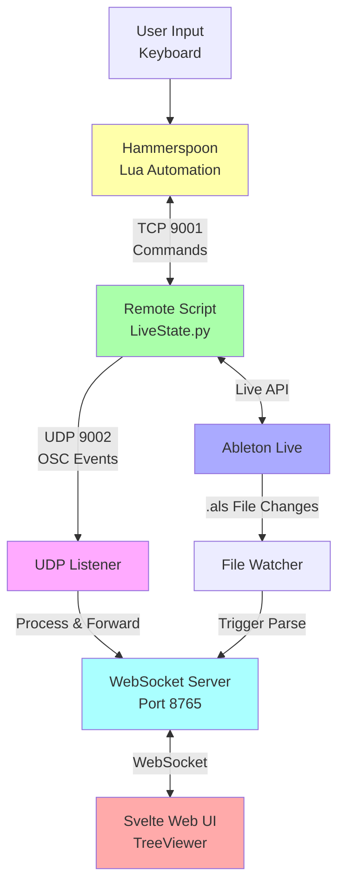
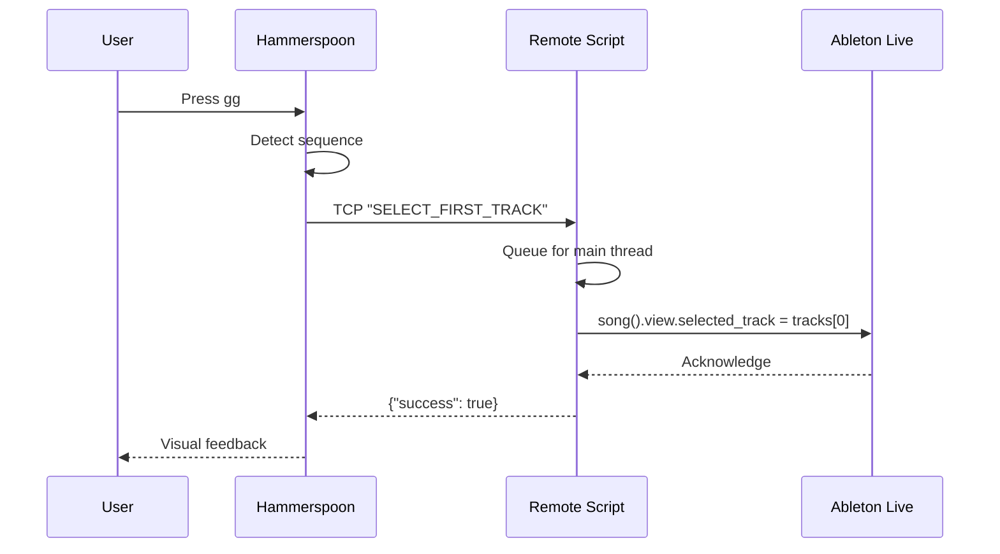
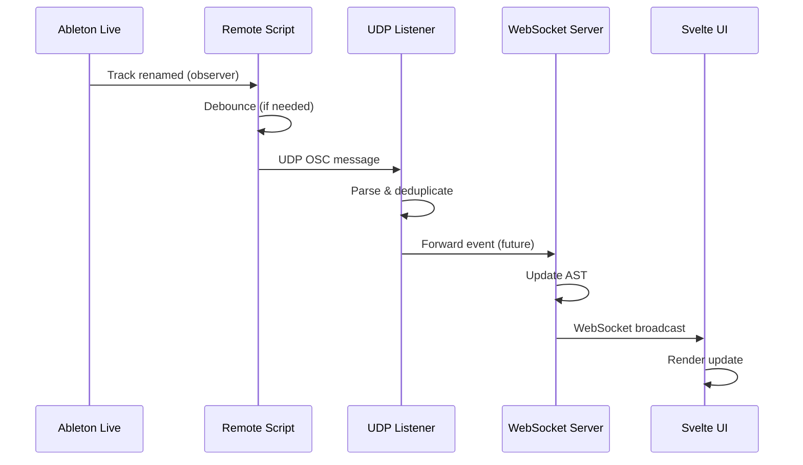
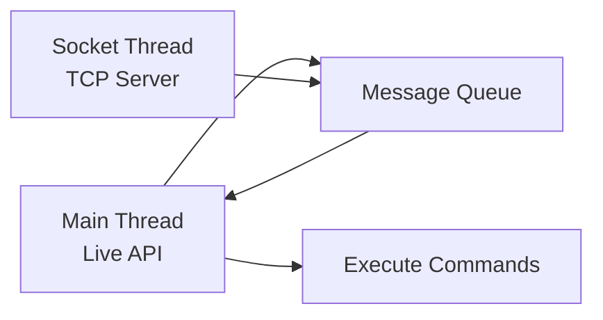

# Architecture Overview

High-level overview of VimAbl's architecture and component design.

## System Architecture



## Core Components

### 1. Hammerspoon Integration
**Technology:** Lua
**Location:** `src/hammerspoon/`

**Responsibilities:**
- Capture keyboard input via eventtaps
- Send commands to Remote Script
- Detect Ableton Live application state
- Auto-start/stop keybindings

**Key Files:**
- `ableton.lua` - Entry point
- `live_state.lua` - Socket client
- `app_watcher.lua` - Application monitoring
- `keys/*.lua` - Keybinding modules

### 2. Python Remote Script
**Technology:** Python 2.7 (Live's embedded Python)
**Location:** `src/remote_script/`

**Responsibilities:**
- Run inside Ableton Live process
- Expose thread-safe command API
- Monitor Live state via observers
- Stream real-time events via UDP/OSC

**Key Files:**
- `LiveState.py` - Main controller
- `observers.py` - Live API observers
- `udp_sender.py` - OSC/UDP streaming
- `commands.py` - Command handlers

### 3. UDP Listener Bridge
**Technology:** Python 3.11+ (asyncio)
**Location:** `src/udp_listener/`

**Responsibilities:**
- Receive OSC events from Remote Script
- Deduplicate messages
- Forward to WebSocket server (future)

**Key Files:**
- `listener.py` - Async UDP server
- `osc_parser.py` - OSC message parser

### 4. WebSocket AST Server
**Technology:** Python 3.11+ (asyncio, websockets)
**Location:** `src/server/`

**Responsibilities:**
- Parse .als files to AST
- Compute incremental diffs
- Stream updates via WebSocket
- Handle client queries

**Key Files:**
- `api.py` - ASTServer implementation
- `watcher.py` - File monitoring

### 5. Svelte Web UI
**Technology:** SvelteKit, TypeScript, Tailwind CSS
**Location:** `src/web/frontend/`

**Responsibilities:**
- Real-time project visualization
- Interactive tree navigation
- Display Live events
- Highlight changes

**Key Files:**
- `src/routes/+page.svelte` - Main view
- `src/lib/components/TreeNode.svelte` - Tree rendering

## Data Flow

### Command Flow (User → Ableton)



### Event Flow (Ableton → UI)



## Communication Protocols

### TCP Socket (Port 9001)
**Purpose:** Command interface
**Direction:** Bidirectional (Hammerspoon ↔ Remote Script)
**Format:** JSON over TCP

**Example:**
```json
// Request
"GET_VIEW"

// Response
{"view": "session"}
```

### UDP/OSC (Port 9002)
**Purpose:** Real-time event streaming
**Direction:** Unidirectional (Remote Script → UDP Listener)
**Format:** OSC over UDP

**Example:**
```
Address: /live/track/renamed
Arguments: [0, "Bass"]
```

### WebSocket (Port 8765)
**Purpose:** AST streaming to UI
**Direction:** Bidirectional (Server ↔ Svelte UI)
**Format:** JSON over WebSocket

**Example:**
```json
{
  "type": "ast_update",
  "data": {
    "tracks": [...]
  }
}
```

## Thread Safety

### Remote Script Threading



**Key Principles:**
1. Live API only accessible from main thread
2. Commands queued via `schedule_message()`
3. Fast-path for read-only operations (GET_VIEW)

### UDP Sender

- Runs on socket thread (non-blocking)
- Fire-and-forget (no acknowledgment)
- < 1ms latency

## Performance Characteristics

| Component | Latency | CPU Usage | Memory |
|-----------|---------|-----------|--------|
| Hammerspoon | < 1ms | < 1% | ~50MB |
| Remote Script | 20-50ms | ~2% | ~20MB |
| UDP Sender | < 1ms | < 0.5% | ~5MB |
| UDP Listener | < 1ms | ~1% | ~30MB |
| WebSocket Server | 10-50ms | ~2% | ~100MB |

## Extension Points

### 1. Add New Commands
- Add handler in `LiveState.py`
- Register in command map
- Add Lua wrapper in `live_state.lua`

### 2. Add New Observers
- Create observer class in `observers.py`
- Register in `LiveState._setup_observers()`
- Define OSC messages

### 3. Add New Keybindings
- Create keybinding in `keys/*.lua`
- Add to appropriate module
- Call Live State command

### 4. Add UI Features
- Extend Svelte components
- Handle WebSocket messages
- Update rendering logic

## Design Principles

### 1. Separation of Concerns
Each component has a single, well-defined responsibility.

### 2. Loose Coupling
Components communicate via well-defined protocols (TCP, UDP, WebSocket).

### 3. Performance First
Minimize latency and CPU usage for real-time feel.

### 4. Fail Gracefully
Components can restart independently without affecting others.

### 5. Developer-Friendly
Symlinks enable rapid iteration during development.

## See Also

- [Python Remote Script](python-remote-script.md) - Remote Script internals
- [Hammerspoon Integration](hammerspoon-integration.md) - Lua automation details
- [WebSocket AST](websocket-ast.md) - AST server and UI
- [Data Flow](data-flow.md) - Detailed data flow diagrams
- [ClipSlot Implementation](clipslot-implementation.md) - ClipSlot matrix architecture
- [Caching System](caching.md) - Performance optimization via caching
- [Metrics & Telemetry](metrics.md) - System monitoring and metrics collection
