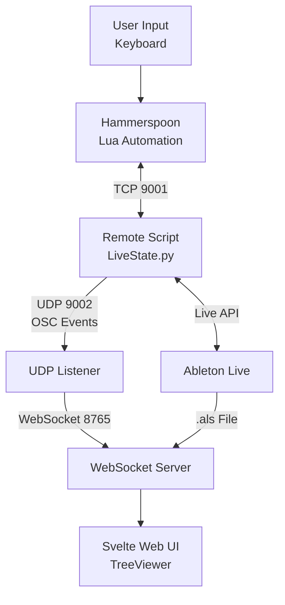

# VimAbl - Ableton Live LSP

!!! info "Welcome to VimAbl"
Vim-like keybindings and LSP-style server functionality for Ableton Live. Control Live with intuitive keyboard shortcuts powered by a Python Remote Script and Hammerspoon automation.

## What is VimAbl?

VimAbl brings the power of Vim-style keyboard navigation to Ableton Live, combined with a real-time LSP-like server architecture for live project visualization and control.

### Key Features

- **🎹 Vim-inspired navigation** - `gg`, `G`, `dd`, `za` and more familiar commands
- **🎯 Context-aware shortcuts** - Different behavior in Arrangement vs Session view
- **🔒 Thread-safe Remote Script** - Exposes Live's state via local socket server (port 9001)
- **⚡ UDP/OSC Real-Time Observers** - Streams Live events with < 10ms latency (port 9002)
- **🎛️ ClipSlot Matrix** - Full track × scene grid with real-time playback states
- **🌲 Web TreeViewer** - Real-time project visualization via WebSocket (port 8765)
- **🧩 Modular architecture** - Easy to extend with new commands
- **🔄 Auto-recovery** - Monitors and restarts eventtaps automatically

## Quick Navigation

### 🚀 Getting Started

- [Installation Guide](installation.md) - Complete setup instructions
- [Quick Start](quick-start.md) - Get up and running in 5 minutes
- [User Guide](user-guide/overview.md) - Learn how to use VimAbl

### 📖 Documentation

- [User Guide](user-guide/overview.md) - Navigation, editing, and keybindings
- [Architecture](architecture/overview.md) - System design and components
- [API Reference](api-reference/commands.md) - Command and protocol documentation
- [Development](development/extending.md) - Extending and contributing

### 🔧 Resources

- [Troubleshooting](troubleshooting.md) - Common issues and solutions
- [FAQ](faq.md) - Frequently asked questions
- [Changelog](changelog.md) - Version history

## System Overview

### Architecture Highlights

- **Hammerspoon Integration** - Lua-based automation for macOS keyboard shortcuts
- **Python Remote Script** - Runs inside Ableton Live, exposes thread-safe API
- **UDP/OSC Observer System** - Real-time event streaming with minimal latency
- **WebSocket AST Server** - Parses and visualizes project structure
- **Svelte Frontend** - Modern web UI for live project visualization

## Performance Metrics

| Metric                    | Target  | Actual | Status        |
| ------------------------- | ------- | ------ | ------------- |
| End-to-end latency        | < 100ms | ~10ms  | ✅ 10x better |
| UDP send time             | < 1ms   | ~0.5ms | ✅ 2x better  |
| CPU usage (Remote Script) | < 5%    | ~2%    | ✅            |
| Packet loss               | < 0.1%  | 0%     | ✅ Perfect    |

## Next Steps

1. **[Install VimAbl](installation.md)** - Set up on your system
2. **[Quick Start Guide](quick-start.md)** - Learn the basics in 5 minutes
3. **[Explore the User Guide](user-guide/overview.md)** - Master all features

## Community & Support

- **GitHub Repository**: [VimAbl on GitHub](https://github.com/MarvinHauke/VimAbl)
- **Issues & Bug Reports**: [GitHub Issues](https://github.com/MarvinHauke/VimAbl/issues)
- **Contributions**: See [Development Guide](development/extending.md)

---

**License:** MIT | **Project Status:** Active Development
