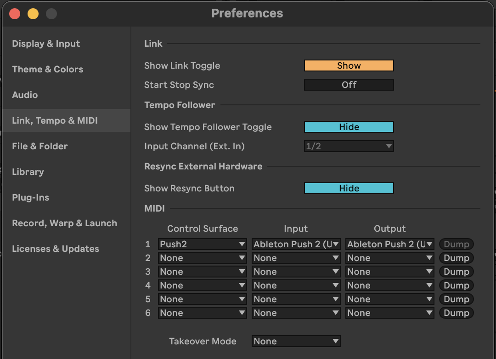

# Installation Guide

This guide will walk you through setting up VimAbl on your system.

## Prerequisites

Before installing VimAbl, ensure you have the following:

- **Ableton Live** - Any version with Remote Script support
- **Hammerspoon** - macOS automation tool ([Download](https://www.hammerspoon.org/))
- **Python 3.11+** - For external tools (AST parser, WebSocket server)
- **uv** - Python package manager ([Install](https://github.com/astral-sh/uv))

## Installation Steps

### 1. Install uv

Choose your preferred installation method:

=== "Shell Script"
    ```bash
    curl -LsSf https://astral.sh/uv/install.sh | sh
    ```

=== "Homebrew"
    ```bash
    brew install uv
    ```

### 2. Install Project Dependencies

```bash
# Navigate to the VimAbl directory
cd /path/to/VimAbl

# Sync all dependencies (creates .venv automatically)
uv sync

# Or with dev dependencies
uv sync --all-extras
```

### 3. Activate Virtual Environment

Choose the method that works best for your workflow:

=== "direnv (Recommended)"
    If you have [direnv](https://direnv.net/) installed:

    ```bash
    # Allow direnv to load .envrc
    direnv allow

    # Now it auto-activates when you cd into the directory!
    cd /path/to/VimAbl  # Environment auto-loads
    ```

=== "uv run"
    ```bash
    # Run commands directly with uv
    uv run python -m src.main --help
    ```

=== "Manual Activation"
    ```bash
    # Activate the virtual environment manually
    source .venv/bin/activate
    python -m src.main --help
    ```

### 4. Install Remote Script

Create a symlink to the remote script in Ableton's Remote Scripts folder:

=== "macOS"
    ```bash
    # Create symlink (recommended for development)
    ln -s "$(pwd)/src/remote_script" ~/Music/Ableton/User\ Library/Remote\ Scripts/LiveState
    ```

=== "Windows"
    ```powershell
    # Create symlink (requires admin privileges)
    mklink /D "%USERPROFILE%\Documents\Ableton\User Library\Remote Scripts\LiveState" "%CD%\src\remote_script"
    ```

!!! tip "Production Alternative"
    For production use, copy instead of symlinking:

    ```bash
    # macOS
    cp -r src/remote_script ~/Music/Ableton/User\ Library/Remote\ Scripts/LiveState

    # Windows
    xcopy /E /I src\remote_script "%USERPROFILE%\Documents\Ableton\User Library\Remote Scripts\LiveState"
    ```

### 5. Enable Remote Script in Ableton

1. Open **Ableton Live Preferences**
2. Go to **Link/Tempo/MIDI** tab
3. Under **Control Surface**, select **LiveState** in an empty slot
4. Set Input/Output to **None**
5. **Restart Ableton Live**



### 6. Install Hammerspoon Scripts

Create symlinks for development (recommended):

```bash
# Create directory structure
mkdir -p ~/.hammerspoon/keys

# Symlink all Hammerspoon files
ln -s "$(pwd)/src/hammerspoon/ableton.lua" ~/.hammerspoon/
ln -s "$(pwd)/src/hammerspoon/app_watcher.lua" ~/.hammerspoon/
ln -s "$(pwd)/src/hammerspoon/config.lua" ~/.hammerspoon/
ln -s "$(pwd)/src/hammerspoon/live_state.lua" ~/.hammerspoon/
ln -s "$(pwd)/src/hammerspoon/status_check.lua" ~/.hammerspoon/
ln -s "$(pwd)/src/hammerspoon/utils.lua" ~/.hammerspoon/
ln -s "$(pwd)/src/hammerspoon/keys/navigation.lua" ~/.hammerspoon/keys/
ln -s "$(pwd)/src/hammerspoon/keys/editing.lua" ~/.hammerspoon/keys/
ln -s "$(pwd)/src/hammerspoon/keys/views.lua" ~/.hammerspoon/keys/
```

!!! tip "Production Alternative"
    For production, copy files instead:

    ```bash
    cp -r src/hammerspoon/*.lua ~/.hammerspoon/
    mkdir -p ~/.hammerspoon/keys
    cp src/hammerspoon/keys/*.lua ~/.hammerspoon/keys/
    ```

### 7. Configure Hammerspoon

Add to your `~/.hammerspoon/init.lua`:

```lua
-- Load Ableton Live integration
require("ableton")
```

Then **reload Hammerspoon config** (Menu bar icon → Reload Config)

### 8. Verify Installation

#### Check Remote Script is Loaded

```bash
# View Ableton's log
tail -f ~/Library/Preferences/Ableton/Live\ */Log.txt

# Look for: "Live State Remote Script initialized"
```

#### Test Server Connection

```bash
echo "GET_VIEW" | nc 127.0.0.1 9001
# Should return: {"view": "session"} or {"view": "arrangement"}
```

#### Test in Hammerspoon Console

Open Hammerspoon console and run:

```lua
liveState = require("live_state")
liveState.selectFirstTrack()
```

You should see the first track in Ableton Live selected.

## Troubleshooting

### Remote Script Not Loading

- ✅ Check folder is named exactly `LiveState`
- ✅ View `~/Library/Preferences/Ableton/Live */Log.txt` for errors
- ✅ Ensure Python script has no syntax errors:
  ```bash
  python3 -m py_compile src/remote_script/LiveState.py
  ```

### Server Connection Fails

```bash
# Check if server is running
lsof -i :9001

# Test manually
echo "GET_STATE" | nc 127.0.0.1 9001
```

### Hammerspoon Not Detecting Live

- ✅ Check console for: `"Ableton VimMode: Application watcher started"`
- ✅ Verify Hammerspoon has accessibility permissions in System Preferences
- ✅ Try reloading Hammerspoon config

## Next Steps

- ✅ [Quick Start Guide](quick-start.md) - Learn the basics
- ✅ [User Guide](user-guide/overview.md) - Explore all features
- ✅ [Keybindings Reference](user-guide/keybindings.md) - Full command list

---

Need more help? Check the [Troubleshooting Guide](troubleshooting.md) or [FAQ](faq.md).
