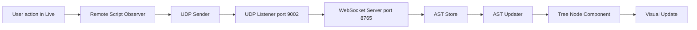

# Web Tree Viewer

The VimAbl Web Tree Viewer provides a real-time visualization of your Ableton Live project structure, displaying tracks, devices, clips, and scenes in an interactive tree view.

## Overview

The Tree Viewer is a web-based interface that connects to the VimAbl backend via WebSocket, displaying the Abstract Syntax Tree (AST) representation of your Live project. It updates in real-time as you make changes in Ableton Live, providing instant visual feedback.

## Features

### Real-Time Updates

- **Live AST synchronization**: Updates immediately when you change your project in Ableton Live
- **Visual change indicators**:
  - **Green highlight**: New nodes added (devices, tracks, etc.)
  - **Yellow highlight**: Modified nodes (renamed tracks, parameter changes)
  - **Red highlight**: Nodes being removed
  - **Blue flash**: General attribute changes
- **Cursor tracking**: Shows which track and clip slot is currently selected in Live
- **Low latency**: < 100ms from action in Live to UI update

### Project Structure Display

- **Hierarchical tree view**: Collapsible nodes showing project structure
- **Track information**:
  - Track names and indices
  - Track colors (matching Ableton's palette)
  - Mute/arm status
  - Volume levels
- **Device chains**: Shows all devices on each track
- **Mixer settings**: Volume, pan, sends
- **Clip slots**: Complete Session View grid with real-time playback states (playing, triggered, stopped, empty)
- **Scenes**: Scene names and structure

### Visual Enhancements

- **Track color coding**: Tracks display their assigned Ableton colors
- **Selected track highlighting**: Blue border around the currently selected track
- **Auto-scroll**: Automatically scrolls to show the selected track
- **Dark mode support**: Seamless dark/light theme switching

#### Clip Slot Visualization

The tree viewer provides detailed visual feedback for every clip slot in the Session View matrix:

| State | Icon | Visual Style | Meaning |
|-------|------|--------------|---------|
| **Playing** | ▶ | Green background | Clip is actively playing |
| **Triggered** | ⏸ | Orange pulse | Clip is queued to launch (quantized) |
| **Stopped** | ■ | Gray | Clip is present but stopped |
| **Empty** | □ | Light gray | Empty slot with stop button |
| **No Stop** | ⊗ | Red text | Empty slot, stop button removed |

This allows you to monitor the exact state of your Session View performance directly from the web interface.

- **Change animations**:
  - Smooth 600ms flash for first change
  - Throttled updates for high-frequency changes (volume, parameters)
  - Silent updates for subsequent changes in a sequence

## Starting the Web Viewer

### Prerequisites

1. VimAbl Remote Script installed in Ableton Live
2. Python environment with VimAbl dependencies
3. A saved Ableton Live project (`.als` file)

### Launch Steps

1. **Start the WebSocket server**:
   ```bash
   uv run python -m src.main path/to/your/project.als --mode=websocket
   ```

   Or use the Hammerspoon integration:
   ```lua
   -- In your Hammerspoon config
   hs.hotkey.bind({"cmd", "shift"}, "v", function()
       vimabl.toggle()  -- Starts server automatically
   end)
   ```

2. **Open the web interface**:
   - Navigate to `http://localhost:8765` in your browser
   - The UI will automatically connect to the WebSocket server

3. **Start making changes in Ableton Live**:
   - Rename tracks, add devices, change parameters
   - Watch the tree view update in real-time

## Connection Status

The UI displays connection status in the top-right corner:

- **🟢 Connected**: WebSocket connection active, receiving updates
- **🟡 Connecting**: Attempting to establish connection
- **🔴 Disconnected**: No connection to server
- **⚠️ Stale**: AST may be out of sync (gap detected in UDP events)

### Stale State

If the connection status shows "Stale", it means some UDP events were missed:

1. **Cause**: More than 5 UDP events were dropped (network congestion, high CPU load)
2. **Impact**: The displayed AST may not match your current Live project
3. **Solution**: Save your project in Ableton Live (Cmd+S) to trigger a full reload

The XML file watcher will detect the save and reload the complete AST, restoring synchronization.

## Visual Change Indicators

### Color-Coded Highlights

| Color | Meaning | Duration | Example |
|-------|---------|----------|---------|
| 🟢 Green | Node added | 1 second | Device dropped onto track |
| 🟡 Yellow | Node modified | 1 second | Track renamed (if not selected) |
| 🔴 Red | Node removed (fade-out) | 1 second | Device deleted |
| 🔵 Blue border | Track selected | Persistent | Track selection in Live |
| 🔵 Blue flash | Attribute changed | 600ms | Volume fader moved |

**Note**: Yellow modification highlights are suppressed when a track is selected. The blue selection border takes precedence to avoid visual confusion.

### Flash Animation Behavior

The flash animation is optimized for usability:

1. **First change**: Flashes immediately to show location in tree
2. **Subsequent changes**: Values update silently (no flash)
3. **Reset**: After 1 second of inactivity, flash is re-enabled

**Example - Dragging a volume fader**:
- First change: **Flash** (shows which track is being edited)
- Continuous dragging: Values update smoothly without flashing
- Pause for 1 second: Next change will flash again

This prevents visual overwhelm during continuous parameter adjustments while still indicating *where* the change is happening.

## Settings Panel

Click the "⚙️ Settings" button to configure:

### Display Options

- **Show track names**: Display track names instead of just indices
- **Show track colors**: Enable/disable Ableton color display

### Performance

The viewer automatically optimizes performance:

- **Throttling**: High-frequency events (volume, tempo) throttled to 100ms
- **Selective rendering**: Only changed nodes re-render
- **Lazy loading**: Nodes rendered on-demand as you expand the tree

## Cursor Tracking

The tree viewer highlights the currently selected elements in Ableton Live:

### Track Selection
- **Visual**: Blue border with shadow around the selected track
- **Auto-scroll**: Selected track automatically scrolls into view
- **Color display**: Shows track color from Live API

### Clip Slot Selection
- **Visual**: Amber/yellow border around the selected clip slot
- **Coordinates**: Shows `[track_index, scene_index]` in console

### Navigation Sync
- Navigate in Live (arrow keys, mouse clicks)
- Tree viewer instantly highlights the new selection
- Useful for understanding the project structure as you navigate

## Event Types

The viewer handles these real-time events from Ableton Live:

### Track Events
- **renamed**: Track name changed
- **mute**: Track muted/unmuted
- **arm**: Track armed/disarmed
- **volume**: Track volume changed
- **color**: Track color changed

### Device Events
- **added**: Device added to track
- **deleted**: Device removed from track
- **param**: Device parameter changed

### Transport Events
- **tempo**: BPM changed
- **play**: Playback started/stopped

### Cursor Events
- **track**: Track selection changed
- **clip_slot**: Clip slot selection changed
- **scene**: Scene selection changed

## Architecture

### Three-Layer System

```
Ableton Live (Remote Script)
    ↓ UDP (port 9002)
VimAbl Backend (Python)
    ↓ WebSocket (port 8765)
Tree Viewer (Svelte)
```

### Update Paths

1. **Real-time UDP events**: Instant updates for parameter changes, mute/arm, etc.
2. **Diff updates**: Incremental changes when you save the project
3. **Full AST reload**: Complete structure when first connecting or after gaps

### Data Flow



## Keyboard Shortcuts

| Key | Action |
|-----|--------|
| Click node | Expand/collapse children |
| Scroll | Navigate tree |

*Note: Currently view-only. Bi-directional control (UI → Live) planned for future release.*

## Browser Compatibility

Tested and supported:

- ✅ Chrome/Brave 90+
- ✅ Firefox 88+
- ✅ Safari 14+
- ✅ Edge 90+

Requires:
- WebSocket support
- ES6+ JavaScript
- CSS Grid and Flexbox

## Troubleshooting

### "Disconnected" Status

1. Check if WebSocket server is running:
   ```bash
   lsof -i :8765 -i :9002
   ```

2. Verify project is loaded:
   ```bash
   uv run python -m src.main project.als --mode=websocket
   ```

3. Check browser console for errors (F12 → Console tab)

### No Updates Appearing

1. **Check Remote Script is running**:
   - Open Live preferences → Link, Tempo & MIDI
   - Look for "VimAbl" in Control Surface list
   - Should show "Online" status

2. **Verify UDP listener**:
   ```bash
   # Send test event
   python3 tools/test_udp_manual.py
   ```

3. **Check browser console** for logs like:
   ```
   [UDP Event #123] /live/track/mute [0, 1]
   [ASTUpdater] Updated track 0 mute to true
   ```

### Colors Not Showing

1. Enable in Settings Panel: "Show track colors"
2. Assign colors to tracks in Live (track color picker)
3. For master/return tracks, colors come from Live API during cursor events

### Highlighting Not Working

The highlighting should work for:
- Track renames (yellow, 1 second)
- Device add (green, 1 second slide-in)
- Device delete (red, 1 second fade-out)
- Track color changes (yellow, 1 second)

If not working:
1. Check browser console for errors
2. Verify `_changeType` markers are being set (check DevTools → Elements)
3. Look for animation classes: `node-added`, `node-modified`, `node-removed`

### Performance Issues

If the UI feels sluggish:

1. **Reduce tree expansion**: Collapse unused sections
2. **Check event frequency**: High CPU load in Live can cause event floods
3. **Monitor browser performance**: F12 → Performance tab
4. **Expected metrics**:
   - < 150ms latency (UDP → UI)
   - < 5MB memory overhead
   - 60 FPS animations

### Stale Warning

If you see the "⚠️ Stale" warning:

1. **Immediate fix**: Save your project (Cmd+S)
2. **Root cause**: UDP event gaps > 5 events
3. **Prevention**:
   - Close other high-bandwidth network apps
   - Reduce Live CPU load (freeze tracks, increase buffer)
   - Check network stability

## Technical Details

### Technology Stack

- **Frontend**: Svelte 5 with TypeScript
- **Backend**: Python 3.11+ with asyncio
- **Communication**: WebSocket (JSON messages)
- **Build**: Vite 5
- **Styling**: TailwindCSS 3

### Message Format

WebSocket messages follow this structure:

```json
{
  "type": "live_event",
  "payload": {
    "event_path": "/live/track/renamed",
    "args": [0, "My Track"],
    "seq_num": 123,
    "timestamp": 1234567890.123
  }
}
```

Types:
- `FULL_AST`: Complete project structure
- `DIFF_UPDATE`: Incremental changes
- `live_event`: Real-time UDP event
- `ERROR`: Error messages

### Performance Characteristics

| Metric | Target | Actual |
|--------|--------|--------|
| End-to-end latency | < 150ms | ~100ms ✅ |
| Flash animation | 500-1000ms | 600ms ✅ |
| Throttle interval | 50-200ms | 100ms ✅ |
| Memory overhead | < 10MB | ~5MB ✅ |

### Svelte 5 Reactivity

The tree viewer uses Svelte 5 runes for fine-grained reactivity:

- **`$state`**: Reactive state management
- **`$derived`**: Computed values that auto-update
- **`$effect`**: Side effects (animations, auto-scroll)
- **`$props`**: Component properties

This ensures only changed nodes re-render, maintaining 60 FPS even with large projects.

## Future Enhancements

### Planned Features

- **Bi-directional control**: Click to mute/solo/arm tracks
- **Clip triggers**: Launch clips from the UI
- **Device parameters**: Edit device settings via UI controls
- **Search**: Find nodes by name or type
- **Filters**: Show only tracks, devices, or clips
- **Zoom**: Adjustable tree density
- **Export**: Save tree view as image

See [Planned Features](../planned-features.md) for full roadmap.

## Related Documentation

- [WebSocket AST Architecture](../architecture/websocket-ast.md)
- [OSC Protocol Reference](../api-reference/osc-protocol.md)
- [UDP Observers](udp-observers.md)
- [Python Remote Script](../architecture/python-remote-script.md)
